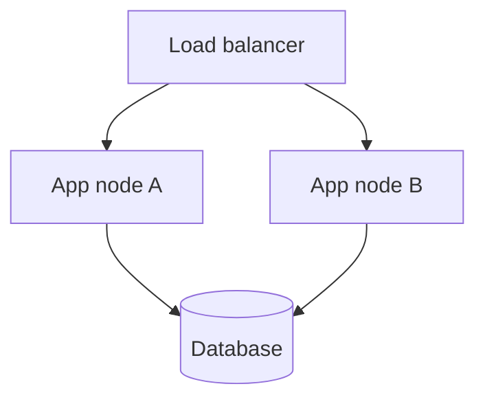

# AE-NNN: [Name]

## Status

DRAFT

*Valid statuses:* `TODO` → `DRAFT` → `PROPOSED` → `ACCEPTED` → `LOCKED` | any stage → `DEPRECATED`

- **TODO** — placeholder; needs review and rewrite against current system state
- **DRAFT** — being written; anything goes
- **PROPOSED** — complete draft ready for review; engineer has not yet accepted
- **ACCEPTED** — engineer approved; downstream work may exist; substantive changes allowed but must cascade
- **LOCKED** — frozen; editorial amendments only; unlock back to PROPOSED for substantive changes
- **DEPRECATED** — terminal; retired from any stage when the artifact is no longer needed

## Subtype

[System | Subsystem | Container | Component | Pipeline | Data Model | Cross-Cutting Concern | Platform Concern | Interface Surface | Workflow / Process]

*Pick exactly one.* The structural triple **System → Container → Component** mirrors C4 strictly. **Subsystem** sits as a logical-grouping convenience above Container. The remaining subtypes cover concerns that C4 does not formalize at the artifact level.

- `System` — the highest-level system under discussion (C4 Software System).
- `Subsystem` — a logical grouping of multiple Containers above the strict C4 hierarchy. Use when a multi-Container concern warrants one AE (e.g., "the inference path", "service architecture as a whole").
- `Container` — a deployable / runnable unit (service, web app, data store, runner). Has its own runtime, deployment, possibly its own internal architecture (C4 Container).
- `Component` — code/functionality grouped inside a Container; not independently deployable (C4 Component).
- `Pipeline` — a sequenced flow of operations; may live inside one Container or span multiple.
- `Data Model` — a canonical structure (tensor, record schema, knowledge-graph shape) that flows through the system.
- `Cross-Cutting Concern` — a concern that spans multiple Containers / Components (security, consistency, observability, lifecycle).
- `Platform Concern` — operational / deployment topology and runtime environment (C4 Deployment perspective).
- `Interface Surface` — boundary between Containers; typically the home of one or more ICs.
- `Workflow / Process` — a dynamic flow described in scenario / sequence form (C4 Dynamic perspective).

See `dekspec/architecture-frameworks-reference.md` for the full arc42/C4 framework reference and the routing rules used by the writing skill.

## Classification

[Core | Supporting | Generic]

*See "Subdomain Classification" in the operating guide. Core = novel competitive advantage, full audit rigor. Supporting = domain-specific infrastructure, triggered-role audit. Generic = commodity patterns, simplified audit.*

## Created

[YYYY-MM-DD]

## Modified

[YYYY-MM-DD]

## Former DN

*(only present for AEs migrated from the legacy Design Note artifact during the DN→AE migration of 2026-04-27)*

[DN-NNN — the legacy ID this AE was migrated from]

## Linked Artifacts

- **Related ADRs:** [auto-populated by `dekspec relink` — the decisions that shape this AE]
- **Related WSs:** [auto-populated by `dekspec relink` — the measurable requirements that constrain this AE]
- **Related ICs:** [auto-populated by `dekspec relink` — the boundary contracts at this AE's edges]
- **Related IBs:** [auto-populated by `dekspec relink` — the implementation plans that target this AE]
- **Related Intents:** [auto-populated by `dekspec relink` — the Intents that cite this AE in §Linked Architecture Elements]
- **Owners:** [name, role, or team]

*The `Related *` lines are **auto-populated by `dekspec relink`** — the author does not hand-maintain them. `dekspec relink` (run standalone, or as the closing step of any `write-*` authoring skill) derives these backlinks deterministically from the forward-link graph and renders each row, using "none" when a category is empty. Leave the bracketed placeholders in place on a freshly-scaffolded AE; running `dekspec relink` replaces them. **Owners** remains author-maintained input.*

## Implements

[File globs (relative to consumer repo root) that this AE is implemented by. The Constraint Compiler reads this when an IC or WS references this AE as Provider / Consumer / Source AE, and uses it to populate `affected_paths` in emitted CI gates — so a merge request touching any of these paths runs the contract tests for every IC bound to this AE.]

- `path/glob/one/*.py`
- `path/glob/two/**/*.ts`

*Optional at DRAFT. Expected at PROPOSED+ for AEs whose ICs need CI gate scoping. Use "none" explicitly when this AE is purely conceptual and has no implementing code (e.g., a Cross-Cutting Concern that's enforced via review, not code). Globs are matched by the consumer's CI; same syntax as GitLab CI `rules.changes:`.*

## Purpose and Scope

[1-2 paragraphs: what this architectural slice is, its role in the larger system, and why it exists as a coherent slice. State the upstream Mission or Intent it serves where applicable.]

## Responsibilities

[What this AE is responsible for. Bullet list of the load-bearing responsibilities — not an exhaustive feature list, the architecturally significant ones.]

- [Responsibility 1]
- [Responsibility 2]

## Boundaries and Non-Goals

[What is *inside* this slice and what is *outside*. Mandatory section. AEs without explicit boundary statements are invalid (Numbered Governance Rule 2).]

**Inside the boundary:**
- [What this AE owns / contains / encompasses]

**Outside the boundary (non-goals):**
- [What this AE explicitly does NOT cover — and why; either it belongs to another AE, or it is intentionally deferred]

*Guardrail:* at least one explicit non-goal with a why clause is required.

## Three-tier Boundaries

<!-- canonical: this section is parsed into the IR `boundaries` field (always_do / ask_first / never_do) -->

[Optional, machine-readable three-tier boundary statement for this AE — what the AE-bounded subsystem *always does*, *asks the engineer about first*, and *never does*. Per ADR-014, an AE three-tier boundary takes precedence over a Constitution Article on the same axis. This section is OPTIONAL: an AE that omits or empties it is still valid — its absence raises only the advisory `T-AE-BOUNDARIES-MISSING` audit finding, never a blocking error.]

**Always do:**
- [A clause naming something the AE-bounded subsystem always does — a non-negotiable invariant of this slice.]

**Ask first:**
- [A clause the agent surfaces to the engineer before proceeding. Advisory rendered text only — there is no notifier or approval-queue hook; the agent is expected to pause and ask.]

**Never do:**
- [A clause naming something the AE-bounded subsystem never does — a hard prohibition for this slice.]

## Relationships and Dependencies

Pre-structured as four named sub-bullets covering the four directions of dependency. Every AE must populate all four (use "none" explicitly when a direction is empty — do not omit the sub-bullet).

**Consumes:** [what this AE reads or receives from upstream — data, events, configuration, or other AEs' output]

**Produces:** [what this AE emits to downstream consumers — data, events, or artifacts that other AEs read]

**Depends on:** [what infrastructure / ADRs / peer AEs this one requires to function — distinct from Consumes; dependency at the level of behavior, not a data flow]

**Consumed by:** [which downstream AEs / components read this AE's Produces]

## Views

[C4 view(s) that materially clarify this AE. Use only the views that *materially* clarify the slice — do not include a diagram for completeness's sake. For structural subtypes (System / Subsystem / Container / Pipeline / Platform Concern), at least one view is normally expected; if absent, justify the absence here.]

[Acceptable view types per `dekspec/architecture-frameworks-reference.md`:]
- *Context view* — emphasis on boundary and external relationships
- *Container view* — major deployable parts and their interactions
- *Component view* — internal structure inside a Container (selective use)
- *Dynamic view* — architecturally significant runtime scenario
- *Deployment view* — environment-specific topology

[Recommended diagram syntax: Mermaid for inline lightweight authoring; Structurizr DSL for large architecture models.]

> **Parser requirement.** Each authored diagram MUST sit under an `### <kind> view` H3 heading — or a `**<kind> view.**` bold inline lead-in on its own line — where `<kind>` is one of `context` / `container` / `component` / `dynamic` / `deployment`. A diagram under any other heading (or no heading at all) is NOT registered by the parser, so `views.diagrams` stays empty and the `T12-AE-VIEWS` audit fires a spurious advisory. An optional ` — <description>` suffix on the heading or lead-in is captured as the diagram's description.

Example of the H3 form the parser recognizes:

### Deployment view — three-node hosting topology

## Runtime Behavior

*(optional — include when the AE has architecturally significant runtime concerns. Subtype `Pipeline`, `Workflow / Process`, and many `Container` AEs typically populate this section.)*

[Architecturally significant runtime scenarios. Pick a few representative flows (ingestion, retrieval, failure handling, startup, cutover) — exhaustive coverage is not the goal. May include a Dynamic view diagram.]

## Data and State

*(optional — include when the AE owns or shapes data / state. Subtype `Data Model` AEs always populate this; some `Container` and `Subsystem` AEs do.)*

[The data structures, invariants, lifecycle, and persistence concerns this AE owns. Schemas live in linked ICs; this section describes the data *shape* and *invariants* at the architectural level.]

## Deployment / Operational Shape

*(optional — include when the AE has deployment-specific concerns. Subtype `Platform Concern` AEs always populate this; many `Container` AEs do.)*

[The runtime topology, environment dependencies, supervision model, scaling shape, and operational concerns this AE imposes or assumes. May include a Deployment view diagram.]

## Constraints and Quality Notes

[Constraints that shape this AE without being measurable requirements. Examples: must remain stateless, must run on a specific OS family, must coexist with X. **Measurable quality requirements (latency, throughput, capacity, SLOs) belong in Working Specs, not here** — link them via the Linked Artifacts section above.]

*Routing rule (per the conversion guide):* if you find yourself writing numbers (p95 latency, throughput targets, retention targets), the content belongs in a WS, not in an AE.

## Open Questions / Planned Follow-ons

[Architectural questions this AE leaves open, plus deferred forward-looking considerations. Distinguish between blocking (must resolve before downstream work) and tracked-only (does not gate progress).]

- [ ] [Open question or planned follow-on] — **Source:** [initial draft / audit / cascade] — **Severity:** [`P0` / `P1` / `P2` / `P3`]

**Severity key:** `P0` = production-incident / cost-runaway reserve. `P1` = critical / blocking — must resolve before downstream work. `P2` = important / approval-blocking. `P3` = advisory / tracked-only — does not gate progress. Historical aliases (parser accepts indefinitely per ADR-013): `blocking` → `P1`; `non_blocking` → `P3`; `critical` → `P1`; `important` / `warning` → `P2`; `minor` / `info` → `P3`. See `docs/dekspec-methodology.md#severity-vocabulary` for the full ladder + alias map.

*Scope:* design-level questions only. Code-gap observations belong in `dekspec/divergences/DIV-NNN-*.md` or `br`, not here.

## Amendment Log

*Add an entry for every change made after Locked status, or when unlocking back to Proposed.*

**Compressed-format policy.** Entries SHOULD follow a one-line-per-entry format. Target: `| YYYY-MM-DD | <Type> | <one-sentence what + reference to delta-doc / commit> | <author> |`. Detailed change narrative belongs in the git commit message — not in the AE body. Historical entries are preserved as-is; the policy applies to new entries going forward.

| Date | Type | Change | Author |
|------|------|--------|--------|
| YYYY-MM-DD | Editorial / Unlock / Substantive | <one-sentence summary + delta / commit reference> | [name or agent] |
